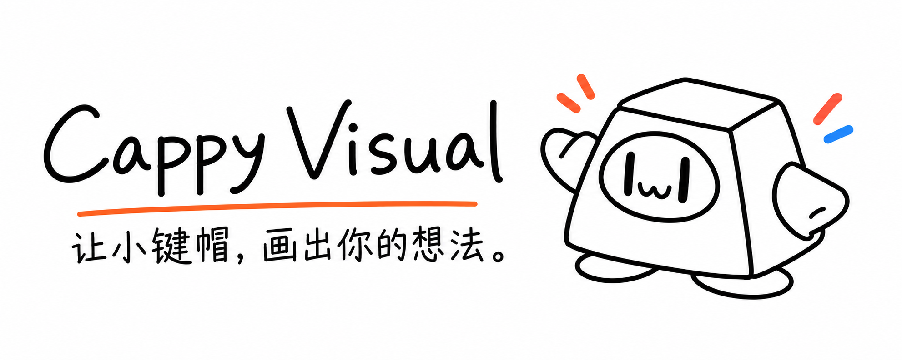
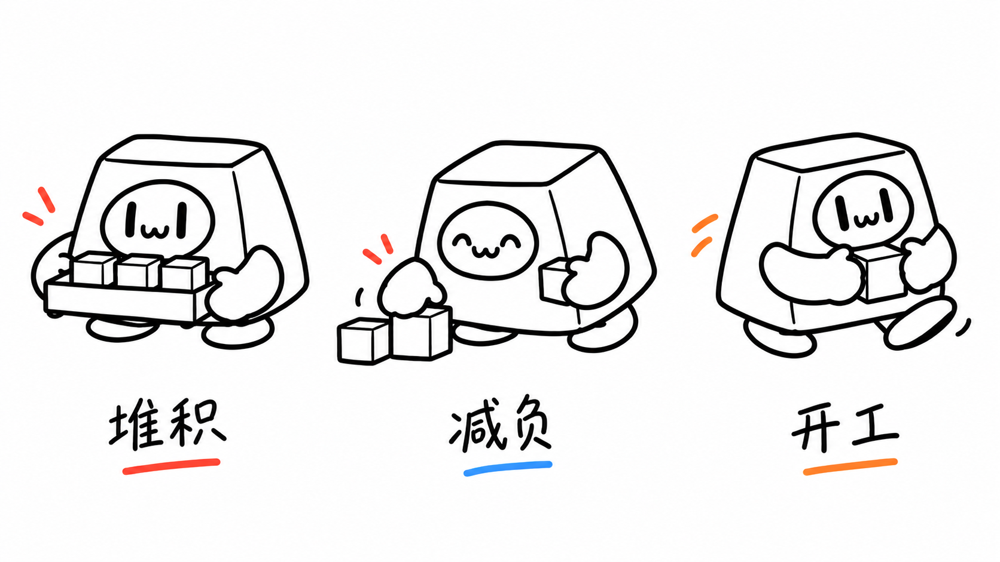
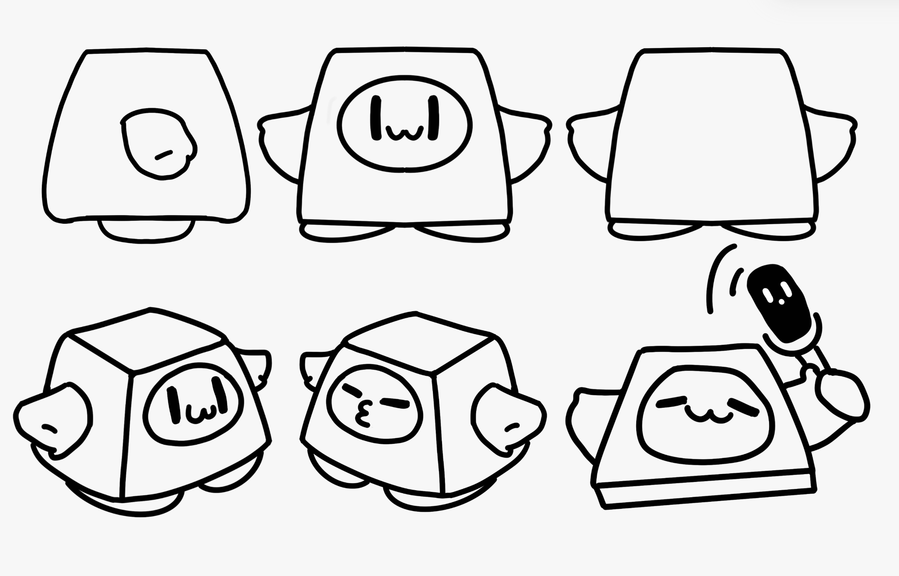
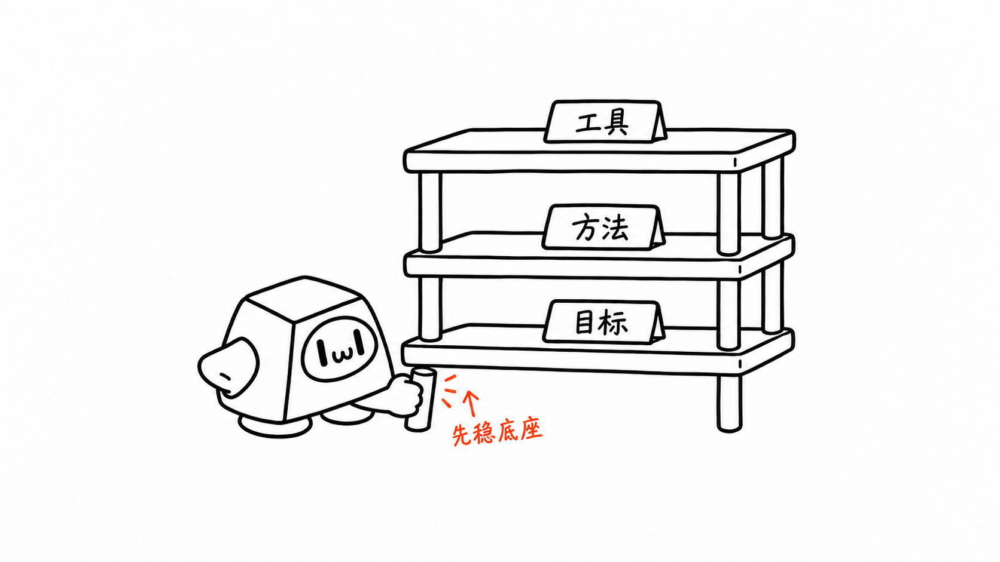
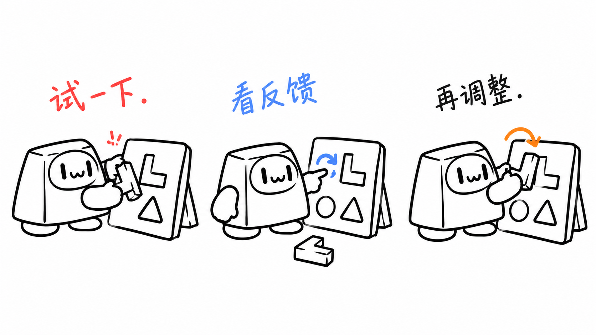

<p align="center">
  
</p>

**Cappy Visual** 是一个为中文文章设计并绘制插画的 Codex Skill。它先找出值得画的观点，再让 Cappy 小键帽亲手完成一个动作，把流程、关系和抽象想法变成清楚、有趣的手绘场景。

**16:9 横版 · 纯白背景 · 黑色手绘 · 少量红橙蓝 · 固定 Cappy IP**

[快速开始](#快速开始) · [认识 Cappy](#认识-cappy) · [8 种构图](#8-种构图) · [全部插画](docs/gallery.md) · [验证记录](docs/validation.md)

## 先看效果

从“堆积”到“减负”，再到“开工”。Cappy 放下多余的任务，带着一件值得做的事往前走。



这是一张实际生成的配图。仓库有 [8 张不同构图的完整样例](docs/gallery.md)，均以 Cappy 原稿为身份依据。新文章会重新设计隐喻，并在出图后逐角色检查手脚、持物接触和遮挡关系。

## 快速开始

需要能加载 Skills 并调用 imagegen 内置绘图工具的 Codex 环境。默认直接生成或编辑图片，无需用户配置 API key。详见 [生成入口与清晰度要求](references/generation-model.md)。

### 安装

把仓库直接克隆到 Skills 目录，目录名使用 `cappy-visual`：

```bash
mkdir -p "${CODEX_HOME:-$HOME/.codex}/skills"
git clone https://github.com/LeeHongji/Cappy-visual.git \
  "${CODEX_HOME:-$HOME/.codex}/skills/cappy-visual"
```

仓库根目录就是技能目录，入口是 [SKILL.md](SKILL.md)。如果已有同名目录，先保留旧版本，再选择更新方式；上面的首次安装命令不会覆盖已有目录。

### 生成第一张图

在加载了该技能的会话中输入：

```text
Use $cappy-visual 为下面这个观点生成一张中文正文插画：
减少同时进行的任务，才能开始行动。

让 Cappy 亲自承担动作。16:9 横版、纯白背景、黑色手绘，
少量红橙蓝批注，中文标注不超过 4 个。
```

技能会设计一个具体隐喻，实际绘图并检查结果，最后交付 PNG、用途和保存路径。项目内默认保存到 `assets/<article-slug>-illustrations/`；也可以指定你自己的目录。

## 认识 Cappy

Cappy 是一枚会做事的小键帽：认真、有一点冷幽默，也保留自然的亲和感。它会剪、推、接、搬、搭、听反馈；画面里的动作要能解释正文里的意思。



它的识别点很简单：

- 白色、上窄下宽的圆角键帽壳，壳就是身体。
- 椭圆脸框、两只黑色竖眼和一个小 `w` 嘴。
- 两侧短手套手，底部短扁脚；转过去能看见顶面与侧面。
- 可以挤眼、惊讶、说话，也可以吃力地干活；角色身份始终保持。

麦克风是可选道具，并非每张都要出现。角色原稿是身份依据，成图中的偶然变化不会成为新设定。完整规则见 [Cappy 角色规范](references/cappy-ip.md) 与 [动作原稿](assets/reference/cappy-interactions.png)。

## 画面是什么风格

像一张白纸上的产品草图：有一点怪，却能很快读懂。

| 画面要素 | 默认规则 |
| --- | --- |
| 背景 | 纯白，不加纸纹、阴影或渐变 |
| 线条 | Cappy、道具和场景统一沿用原稿的圆润黑色轮廓，略带自然手绘感 |
| 留白 | 主场景约占画面 40%–60%，至少约 35% 留白 |
| 中文 | 轻、短、自然的手写批注，通常 3–5 处，最多 5–8 处 |
| 红色 | 重点、问题、提醒与结果 |
| 橙色 | 主流程、路径与移动关系 |
| 蓝色 | 补充说明、反馈与状态 |

一张图只表达一个核心意思。角色和场景使用同一套轮廓语言，文字则更轻，像边画边写的备注。Cappy 的壳与脸内部保持白色；颜色用于解释关系，不把角色涂成另一个形象。完整说明见 [风格 DNA](references/style-dna.md)。

## 8 种构图

同一套画风可以表达不同内容，不必每次都画成流程图。

| 构图 | 适合表达 | 实际样例 |
| --- | --- | --- |
| 流程 | 输入、处理、输出 | [剪掉任务分支](assets/examples/01-prune-the-task.png) |
| 系统局部 | 判断、过滤、反馈 | [把反馈送回判断](assets/examples/02-open-the-feedback-hatch.png) |
| 前后对比 | 散乱到有序 | [收绕散乱线索](assets/examples/03-wind-up-the-loose-ends.png) |
| 角色状态 | 负重、减负、行动 | [放下多余负担](assets/examples/04-put-down-the-load.png) |
| 概念隐喻 | 抽象观点与关系 | [称一称判断的分量](assets/examples/05-weigh-the-judgment.png) |
| 方法分层 | 目标、方法、工具 | [先稳底座](assets/examples/06-fit-the-foundation.png) |
| 地图路线 | 想法到试跑、上线 | [铺好下一步](assets/examples/07-lay-the-next-step.png) |
| 小漫画分镜 | 尝试、反馈、调整 | [尝试拼装、看反馈、再调整](assets/examples/08-listen-and-adjust.png) |



## 怎么用

### 只要配图建议

```text
Use $cappy-visual 先不要生图。
请分析下面这篇文章哪里值得配图，输出 shot list。
每张写清楚：放在哪段后、主题、核心意思、构图类型、
Cappy 的动作、建议元素和中文标注。

<粘贴正文>
```

默认建议 4–8 张，短文 1–3 张，长文一般不超过 9 张。挑关键段落，不平均配图。只要求建议时，不自动生成图片。

### 为整篇文章生成插画

```text
Use $cappy-visual 为下面这篇文章生成 4 张正文配图。
每张单独生成，只讲一个核心意思。
白底、黑色手绘、少量红橙蓝中文批注，Cappy 承担核心动作。
保存到 assets/my-article-illustrations/。

<粘贴正文>
```

使用 imagegen 内置工具时，技能会从策略直接进入绘图，不停在提示词。每张都附上 Cappy 原稿作为身份参考，一系列插画不会被拼成一张总览图。

### 去标题、改字或换角色

```text
Use $cappy-visual 编辑这张图：
去掉左上角的“流程图”标题与下划线，其他内容保持。
```

```text
Use $cappy-visual 把这张图的红色标注“多余”改为“无关”。
保留其他文字、Cappy、道具与路径；另存为 -v2，不覆盖原图。
```

也可以把已有图中的角色换为 Cappy，让它接手同一个动作。窄修改优先局部编辑；需要重新设计核心动作时再重生成。编辑后会重新检查角色、中文、颜色与结构。

## 从正文到插画

**读正文 → 找关键观点 → 设计动作与接触关系 → imagegen 生成 → 必做一轮视觉审核 → 修正后复审 → 保存交付**

每次生成或编辑后，都必须对照原稿，按原始分辨率检查每个角色的两只手、两只脚、连接处、抓握接触和遮挡，再检查整体构图、中文与清晰度。有残缺、悬浮、穿插、抓空或无法解释的遮挡时必须返工，不能仅凭“看起来像 Cappy”放行。审核规则见 [QA 清单](references/qa-checklist.md)。

物件来自纸箱、抽屉、秤、梯子、旧机器等具体事物；动作来自剪、接、推、搬、称、搭等物理操作。选一个奇怪但成立的组合，帮助读者理解观点。不要照抄样例的物件、动作与布局。



## 适合哪些任务

中文文章、博客、知识型帖子、方法论、产品与 AI 工作流文档，以及需要把一个抽象观点画清楚的场景。

默认产出是正文插画 PNG 和配图策略。PPT、复杂架构图、商业海报、写满说明的课程页、严格可编辑的矢量插画属于其他交付形式。README 封面也使用 imagegen 生成高清图，并接受同样的 IP 与肢体审核。

## 验证与使用边界

每次出图必须完成一轮视觉审核：既检查角色是否像 Cappy，也检查它的手实际握住了什么、两脚在哪里、遮挡是否成立。发现问题就修正并重新检查。生成、编辑、保存和本轮视觉核对的范围见 [验证记录](docs/validation.md)。

图片生成具有随机性，中文和角色一致性需要逐张 QA；局部编辑可能出现邻近区域的轻微漂移。读取网页或 Notion 内容依赖环境里的读取工具和权限，这部分未连接真实外部账户实测。工具不可用时会如实说明，不用占位图冒充完成的插画。

## 目录

```text
.
├── README.md                 项目首页与使用方法
├── SKILL.md                  技能入口
├── agents/openai.yaml        名称与调用信息
├── references/               角色、画风、构图、提示词与 QA
├── assets/
│   ├── reference/            Cappy 原始角色设定
│   ├── examples/             8 张实际生成的插画
│   └── readme/               imagegen 生成的 PNG 封面
├── docs/                     插画画廊与验证记录
├── LICENSE
└── NOTICE.md
```

本地开发参考、失败草稿和原始运行日志不随公共仓库发布。技能规则、角色原稿和最终选用的样例保存在仓库内。

## License

本项目以 [MIT License](LICENSE) 发布，第三方版权与来源声明保留在 [NOTICE.md](NOTICE.md)。
