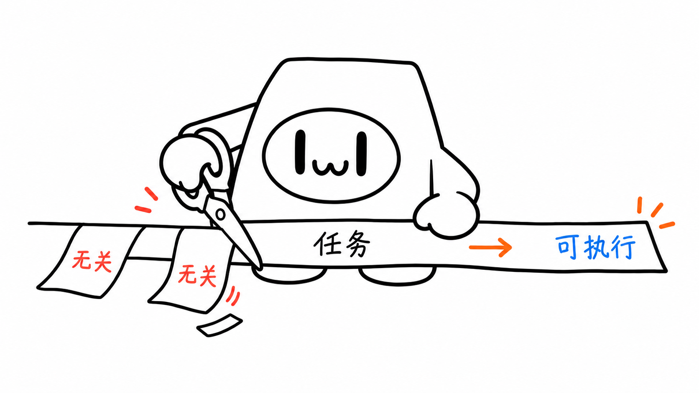
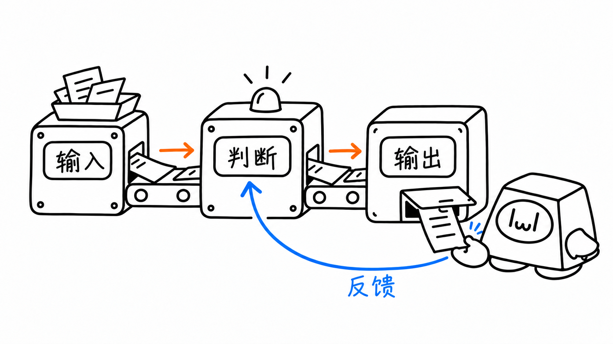
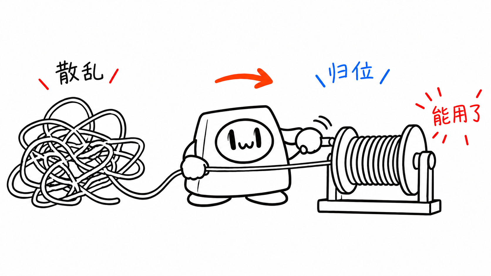
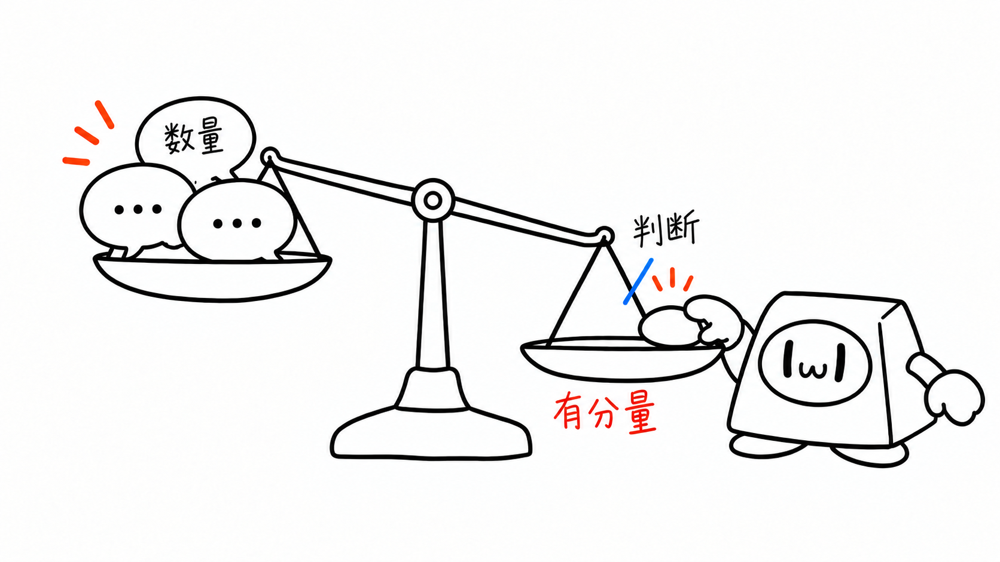
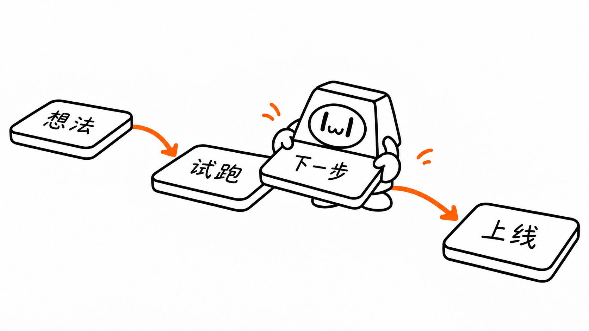

# Cappy 插画画廊

8 张使用 imagegen 内置工具生成并迭代修正的正文插画，覆盖 8 种构图。每张单独绘制，严格参考 Cappy 原稿。点击图片可查看原图；样例用于观察风格，新文章仍需重新设计隐喻并执行视觉审核。

## 01 · 流程：剪掉多余任务

让 Cappy 亲自处理输入，展示从复杂要求到可执行任务的变化。

## 02 · 系统局部：把反馈送回判断

橙色主流经过输入、判断和输出，Cappy 接回输出便条；蓝色反馈箭头回到判断环节。

## 03 · 前后对比：收绕散乱线索

散乱绳线被收成整齐的一卷；Cappy 一只手引导绳线，另一只手操作轴杆。

## 04 · 角色状态：放下多余负担

三个状态保持同一角色：负重、卸下多余任务、带着一件任务开始行动。

## 05 · 概念隐喻：判断的分量

Cappy 把一颗代表判断的石子放上秤盘，与另一侧的气泡数量比较，让抽象的分量变得可见。

## 06 · 方法分层：先稳底座

目标在底、方法居中、工具在顶。Cappy 拿着缺失的支腿，准备补稳底座。

## 07 · 地图路线：铺好下一步

从想法到试跑、上线，Cappy 亲手把下一块踏脚石放到路线里。

## 08 · 小漫画分镜：试一下，再调整

尝试拼装、观察方向反馈，再旋转玩具拼块；三个小场景围绕同一个迭代过程。

[返回项目首页](../README.md) · [角色规范](../references/cappy-ip.md) · [验证记录](validation.md)
